# Technical Architecture Documentation

## Table of Contents

1. [System Overview](#system-overview)
2. [Core Architecture](#core-architecture)
3. [Component Details](#component-details)
4. [Data Flow](#data-flow)
5. [Module Interactions](#module-interactions)
6. [Deployment Architecture](#deployment-architecture)
7. [Development Guidelines](#development-guidelines)

## System Overview

**humanus.cpp** is a lightweight C++ framework for building local LLM agents with integrated tool support and memory capabilities. The system is designed around modularity, performance, and extensibility.

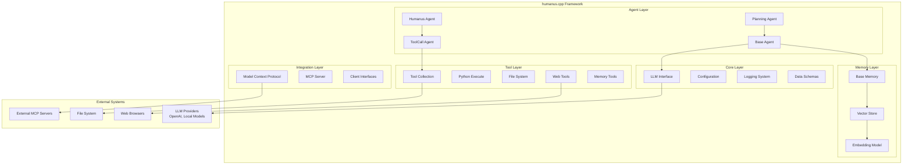

### Key Design Principles

- **Modularity**: Clear separation between agents, tools, memory, and integration layers
- **Performance**: C++ implementation for minimal overhead and fast execution
- **Extensibility**: Plugin-style architecture for tools and memory backends
- **Interoperability**: MCP integration for standardized tool communication

## Core Architecture

### Agent Hierarchy

The agent system follows an inheritance-based design with increasing specialization:

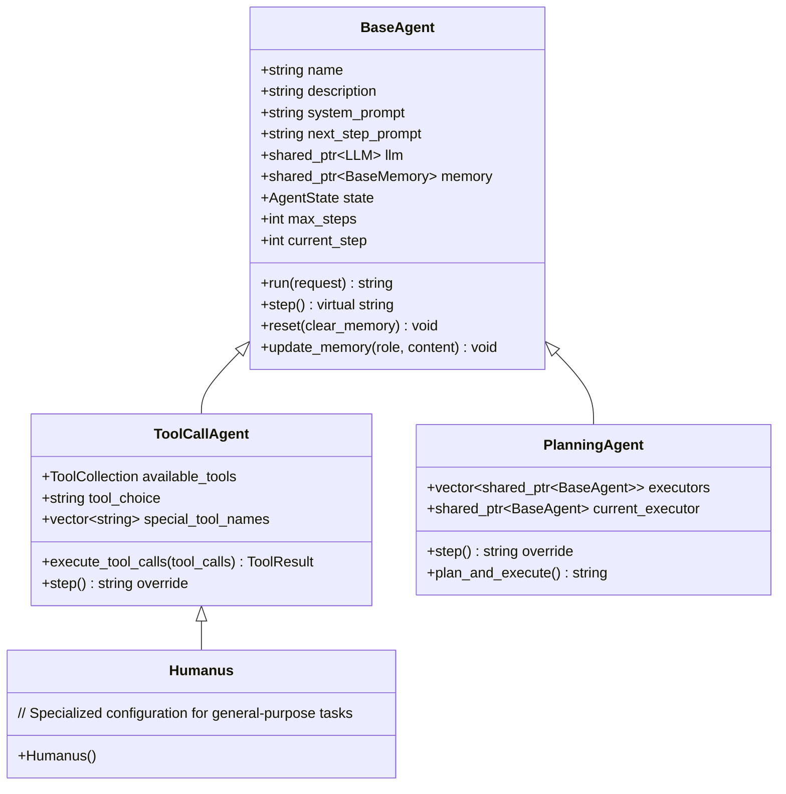

### Tool System Architecture

The tool system provides a flexible plugin architecture:

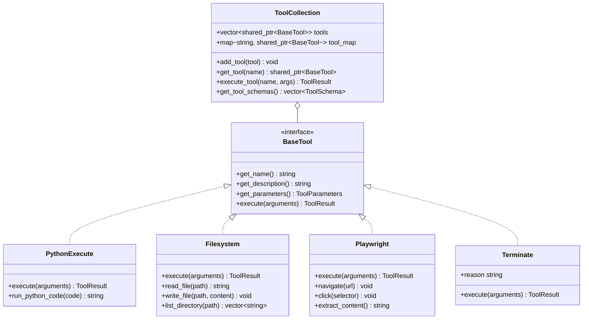

### Memory System Architecture

The memory system provides both simple message storage and advanced vector-based retrieval:

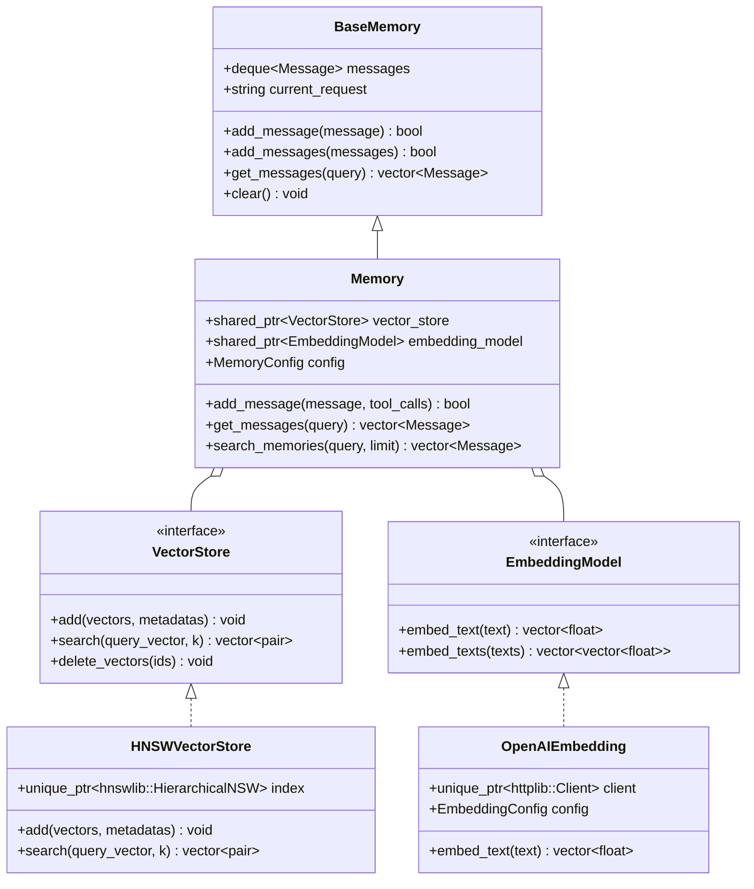

## Component Details

### LLM Interface Layer

The LLM interface provides a unified API for different language model providers:

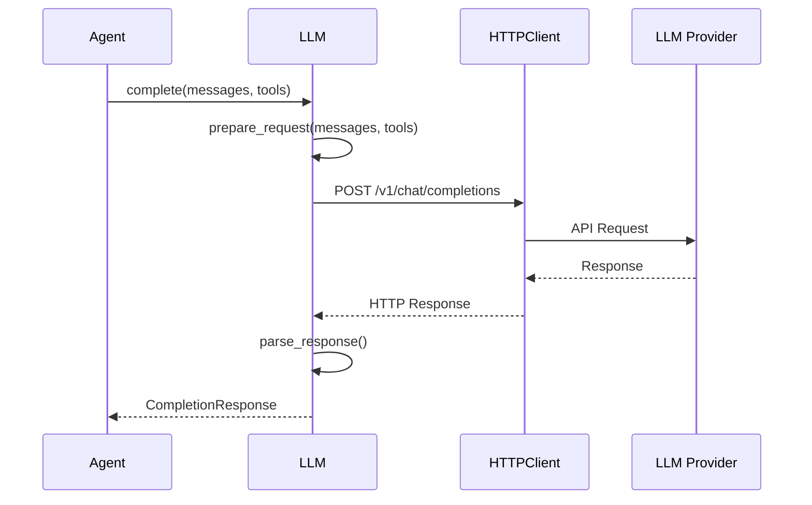

### Model Context Protocol (MCP) Integration

MCP enables standardized communication with external tools and services:

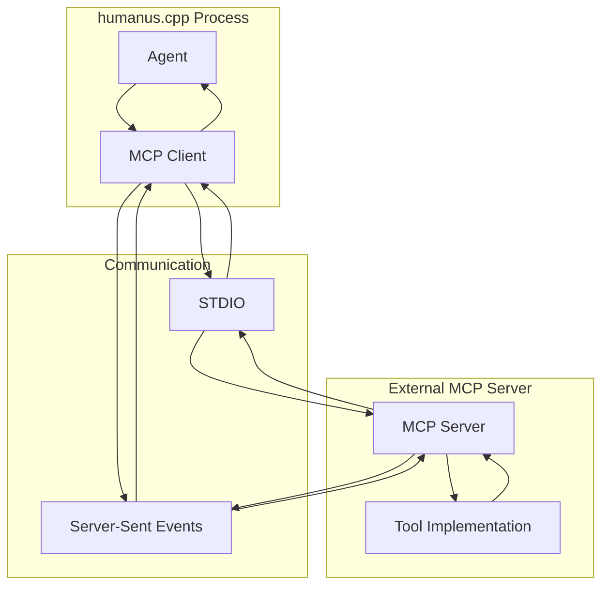

### Configuration System

The configuration system manages settings across different components:

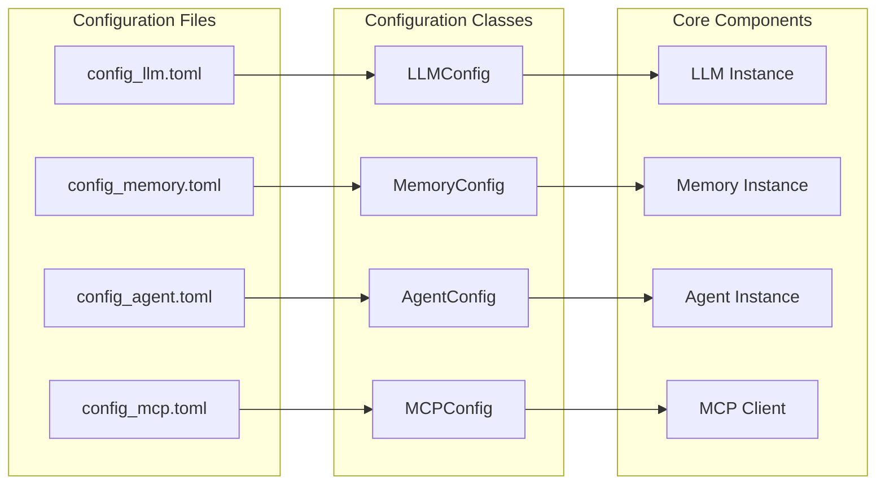

## Data Flow

### Agent Execution Flow

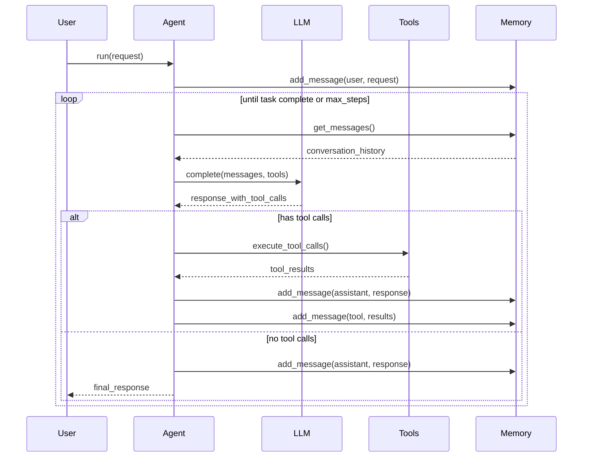

### Memory Retrieval Flow

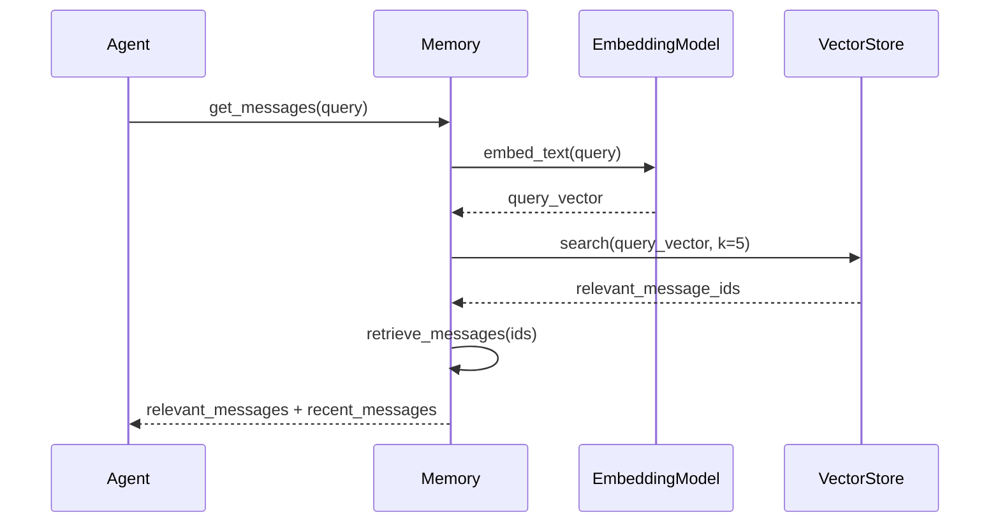

### Tool Execution Flow

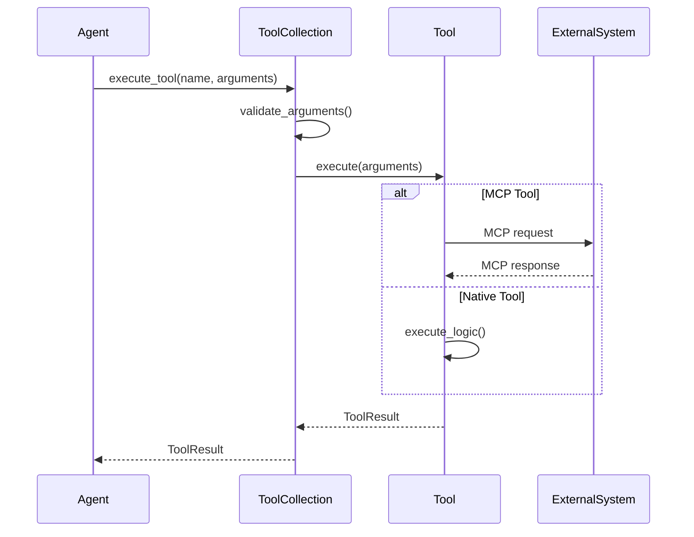

## Module Interactions

### Core Dependencies

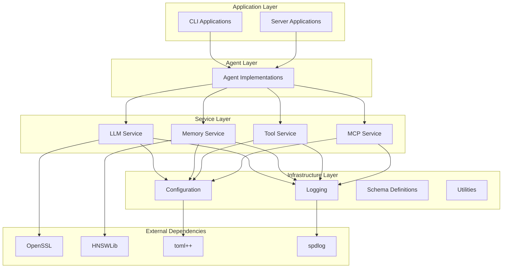

### Build System Architecture

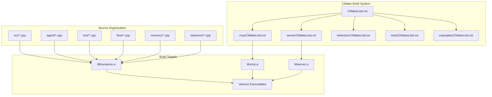

## Deployment Architecture

### Local Development Setup

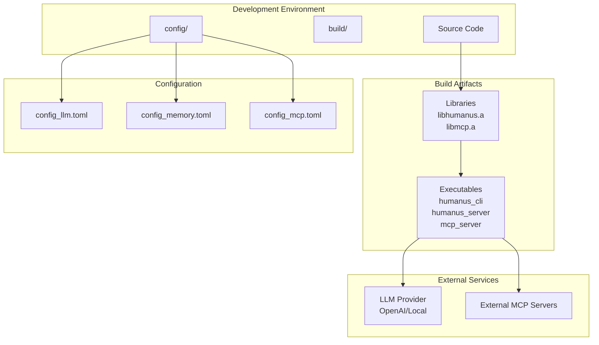

### Production Deployment Options

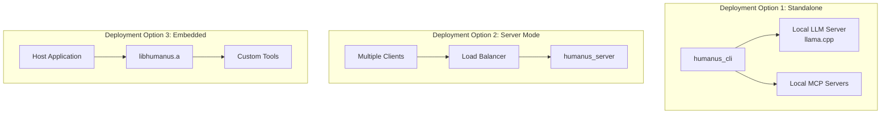

## Development Guidelines

### Adding New Tools

1. **Inherit from BaseTool**: Implement the required interface methods
2. **Define Tool Schema**: Specify parameters and descriptions
3. **Register with ToolCollection**: Add to available tools
4. **Handle MCP Integration**: If needed, implement MCP client communication

```cpp
class CustomTool : public BaseTool {
public:
    std::string get_name() override { return "custom_tool"; }
    std::string get_description() override { return "Description"; }
    ToolParameters get_parameters() override { /* define params */ }
    ToolResult execute(const json& arguments) override { /* implementation */ }
};
```

### Adding New Agent Types

1. **Inherit from BaseAgent or ToolCallAgent**: Choose appropriate base class
2. **Override step() method**: Implement agent-specific logic
3. **Configure prompts**: Define system and next-step prompts
4. **Set up tools**: Configure available tool collection

### Memory Backend Integration

1. **Implement VectorStore interface**: For new vector database backends
2. **Implement EmbeddingModel interface**: For new embedding providers
3. **Update MemoryConfig**: Add configuration options
4. **Test integration**: Ensure compatibility with existing memory system

### Best Practices

- **Error Handling**: Use exceptions for unrecoverable errors, return error states for recoverable ones
- **Logging**: Use the integrated spdlog system for consistent logging
- **Configuration**: Use TOML files for all configuration needs
- **Memory Management**: Use smart pointers for automatic memory management
- **Thread Safety**: Consider thread safety for server deployments

This architecture documentation provides a comprehensive overview of the humanus.cpp framework's design, components, and usage patterns. The modular design enables easy extension and customization while maintaining performance and reliability.