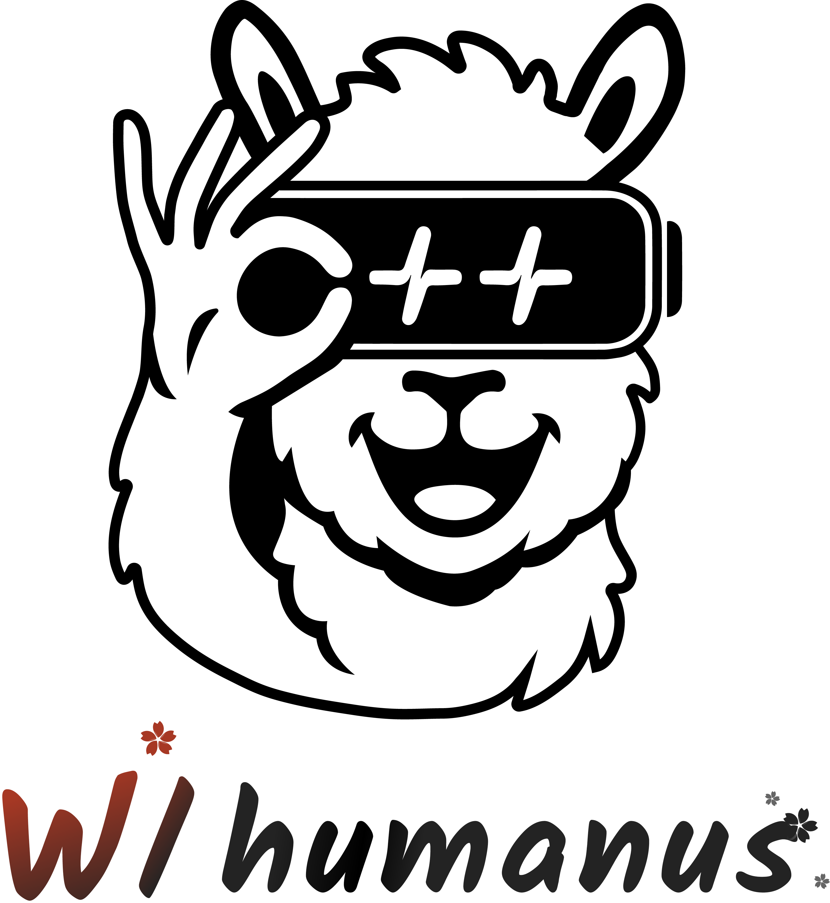

<p align="center">
  
</p>

English | [中文](README.zh.md) 

[](https://github.com/WHU-MYTH-Lab/humanus.cpp/stargazers) &ensp;
[](https://opensource.org/licenses/MIT) &ensp;

# humanus.cpp

**Humanus** (Latin for "human") is a **lightweight C++ framework** inspired by [OpenManus](https://github.com/mannaandpoem/OpenManus) and [mem0](https://github.com/mem0ai/mem0), integrated with the Model Context Protocol (MCP). This project aims to provide a fast, modular foundation for building local LLM agents.

**Key Features:**
- **C++ Implementation**: Core logic in efficient C++, optimized for speed and minimal overhead
- **Lightweight Design**: Minimal dependencies and simple architecture, ideal for embedded or resource-constrained environments
- **Cross-platform Compatibility**: Runs on Linux, macOS, and Windows
- **MCP Protocol Integration**: Native support for standardized tool interaction via MCP
- **Vectorized Memory**: Context retrieval using HNSW-based similarity search
- **Modular Architecture**: Easy to plug in new models, tools, or storage backends

**Humanus is still in its early stages** — it's a work in progress, evolving rapidly. We’re iterating openly, improving as we go, and always welcome feedback, ideas, and contributions.

Let's explore the potential of local LLM agents with **humanus.cpp**!

## Project Demo

<video src="https://private-user-images.githubusercontent.com/54173798/433116754-6e0b8c07-7ead-4e25-8fec-de3a3031f583.mp4?jwt=eyJhbGciOiJIUzI1NiIsInR5cCI6IkpXVCJ9.eyJpc3MiOiJnaXRodWIuY29tIiwiYXVkIjoicmF3LmdpdGh1YnVzZXJjb250ZW50LmNvbSIsImtleSI6ImtleTUiLCJleHAiOjE3NDQ1MzI0NzMsIm5iZiI6MTc0NDUzMjE3MywicGF0aCI6Ii81NDE3Mzc5OC80MzMxMTY3NTQtNmUwYjhjMDctN2VhZC00ZTI1LThmZWMtZGUzYTMwMzFmNTgzLm1wND9YLUFtei1BbGdvcml0aG09QVdTNC1ITUFDLVNIQTI1NiZYLUFtei1DcmVkZW50aWFsPUFLSUFWQ09EWUxTQTUzUFFLNFpBJTJGMjAyNTA0MTMlMkZ1cy1lYXN0LTElMkZzMyUyRmF3czRfcmVxdWVzdCZYLUFtei1EYXRlPTIwMjUwNDEzVDA4MTYxM1omWC1BbXotRXhwaXJlcz0zMDAmWC1BbXotU2lnbmF0dXJlPWQzZDM4MGMzZjExN2RhNDE5ZDFhYWMzYmZkMjJiZjI0ZDE1MTk1Mzk0YjFkNzhjYjhlZjBhOWI5NTRhZDJmNjMmWC1BbXotU2lnbmVkSGVhZGVycz1ob3N0In0.PMbjc8jfhyTQHrCisJzNNjdllLART95rPDY5E1A2vM8" 
       controls 
       muted 
       style="max-height:640px; border:1px solid #ccc; border-radius:8px;">
</video>

## How to Build

```bash
git submodule update --init

cmake -B build
cmake --build build --config Release
```

## How to Run

### Configuration

To set up your custom configuration, follow these steps:

1. Copy all files from `config/example` to `config`.
2. Replace `base_url`, `api_key`, .etc in `config/config_llm.toml` and other configurations in `config/config*.toml` according to your need.
    > Note: `llama-server` in [llama.cpp](https://github.com/ggml-org/llama.cpp) also supports embedding models for vectorized memory.
3. Fill in `args` after `"@modelcontextprotocol/server-filesystem"` for `filesystem` to control the access to files. For example:
```
[filesystem]
type = "stdio"
command = "npx"
args = ["-y",
        "@modelcontextprotocol/server-filesystem",
        "/Users/{Username}/Desktop",
        "other/path/to/your/files]
```

### `mcp_server`

(for tools, only `python_execute` as an example now)

Start a MCP server with tool `python_execute` on port 8895 (or pass the port as an argument):
```bash
./build/bin/mcp_server <port> # Unix/MacOS
```

```shell
.\build\bin\Release\mcp_server.exe <port> # Windows
```

### `humanus_cli`

Run with tools `python_execute`, `filesystem` and `playwright` (for browser use):

```bash
./build/bin/humanus_cli # Unix/MacOS
```

```shell
.\build\bin\Release\humanus_cli.exe # Windows
```

### `humanus_cli_plan` (WIP)

Run planning flow (only agent `humanus` as executor):
```bash
./build/bin/humanus_cli_plan # Unix/MacOS
```

```shell
.\build\bin\Release\humanus_cli_plan.exe # Windows
```

### `humanus_server` (WIP)

Run agents in MCP the server (default running on port 8896):
- `humanus_initialze`: Pass JSON configuration (like in `config/config.toml`) to initialize an agent for a session. (Only one agent will be maintained for each session/client)
- `humanus_run`: Pass `prompt` to tell the agent what to do. (Only one task at a time)
- `humanus_terminate`: Stop the current task.
- `humanus_status`: Get the current states and other information about the agent and the task. Returns:
  - `state`: Agent state.
  - `current_step`: Current step index of the agent.
  - `max_steps`: Maximum steps executing without interaction with the user.
  - `prompt_tokens`: Prompt (input) tokens consumption.
  - `completion_tokens`: Completion (output) tokens consumption.
  - `log_buffer`: Logs in the buffer, like `humanus_cli`. Will be cleared after fetched.
  - `result`: Explaining what the agent did. Not empty if the task is finished.

```bash
./build/bin/humanus_server <port> # Unix/MacOS
```

```shell
.\build\bin\Release\humanus_cli_plan.exe <port> # Windows
```

Configure it in Cursor:
```json
{
  "mcpServers": {
    "humanus": {
      "url": "http://localhost:8896/sse"
    }
  }
}
```

> Experimental feature: MCP in MCP! You can run `humanus_server` and connect to it from another MCP server or `humanus_cli`.

## Acknowledgement

<p align="center">
  
  
</p>

This work was supported by the National Natural Science Foundation of China (No. 62306216) and the Natural Science Foundation of Hubei Province of China (No. 2023AFB816).

## Cite

```bibtex
@misc{humanus_cpp,
  author = {Zihong Zhang and Zuchao Li},
  title = {humanus.cpp: A Lightweight C++ Framework for Local LLM Agents},
  year = {2025}
}
```