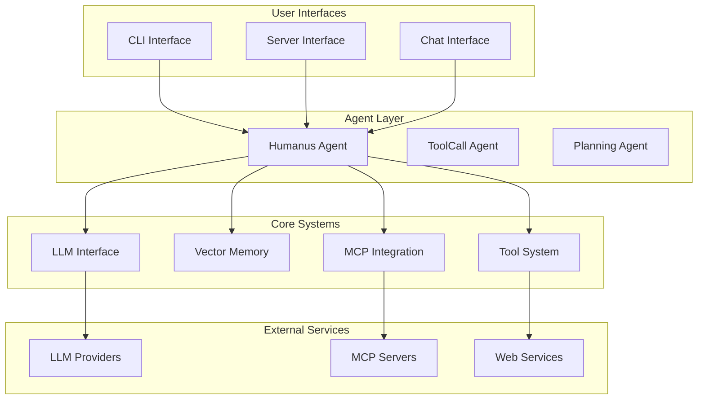
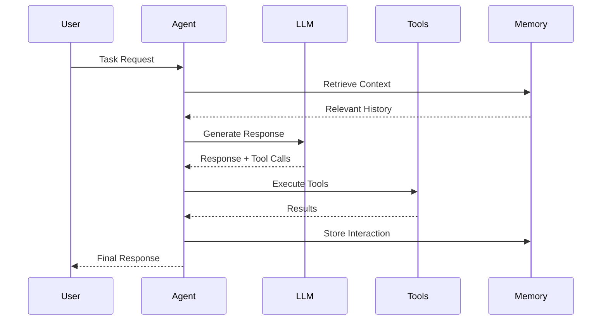

<p align="center">
  
</p>

English | [中文](README.zh.md) 

[](https://github.com/WHU-MYTH-Lab/humanus.cpp/stargazers) &ensp;
[](https://opensource.org/licenses/MIT) &ensp;

# humanus.cpp

**Humanus** (Latin for "human") is a **lightweight C++ framework** inspired by [OpenManus](https://github.com/mannaandpoem/OpenManus) and [mem0](https://github.com/mem0ai/mem0), integrated with the Model Context Protocol (MCP). This project aims to provide a fast, modular foundation for building local LLM agents.

## 🚀 Key Features

- **🏎️ High Performance**: Core logic in efficient C++, optimized for speed and minimal overhead
- **🪶 Lightweight Design**: Minimal dependencies and simple architecture, ideal for embedded or resource-constrained environments
- **🔄 Cross-platform Compatibility**: Runs on Linux, macOS, and Windows
- **🔌 MCP Protocol Integration**: Native support for standardized tool interaction via Model Context Protocol
- **🧠 Vectorized Memory**: Context retrieval using HNSW-based similarity search for intelligent memory management
- **🧩 Modular Architecture**: Easy to plug in new models, tools, or storage backends
- **🛠️ Rich Tool Ecosystem**: Built-in support for Python execution, web browsing, file operations, and more
- **🎯 Multi-Agent Support**: Planning agents, tool-calling agents, and specialized agent types

## 📋 Table of Contents

- [System Architecture](#system-architecture)
- [Quick Start](#quick-start)
- [Configuration](#configuration)
- [Usage Examples](#usage-examples)
- [Documentation](#documentation)
- [Development](#development)
- [Acknowledgements](#acknowledgements)

## 🏗️ System Architecture



For detailed architecture documentation, see [ARCHITECTURE.md](ARCHITECTURE.md).

**Humanus is still in its early stages** — it's a work in progress, evolving rapidly. We're iterating openly, improving as we go, and always welcome feedback, ideas, and contributions.

Let's explore the potential of local LLM agents with **humanus.cpp**!

## 🎬 Project Demo

<video src="https://private-user-images.githubusercontent.com/54173798/433116754-6e0b8c07-7ead-4e25-8fec-de3a3031f583.mp4?jwt=eyJhbGciOiJIUzI1NiIsInR5cCI6IkpXVCJ9.eyJpc3MiOiJnaXRodWIuY29tIiwiYXVkIjoicmF3LmdpdGh1YnVzZXJjb250ZW50LmNvbSIsImtleSI6ImtleTUiLCJleHAiOjE3NDQ1MzI0NzMsIm5iZiI6MTc0NDUzMjE3MywicGF0aCI6Ii81NDE3Mzc5OC80MzMxMTY3NTQtNmUwYjhjMDctN2VhZC00ZTI1LThmZWMtZGUzYTMwMzFmNTgzLm1wND9YLUFtei1BbGdvcml0aG09QVdTNC1ITUFDLVNIQTI1NiZYLUFtei1DcmVkZW50aWFsPUFLSUFWQ09EWUxTQTUzUFFLNFpBJTJGMjAyNTA0MTMlMkZ1cy1lYXN0LTElMkZzMyUyRmF3czRfcmVxdWVzdCZYLUFtei1EYXRlPTIwMjUwNDEzVDA4MTYxM1omWC1BbXotRXhwaXJlcz0zMDAmWC1BbXotU2lnbmF0dXJlPWQzZDM4MGMzZjExN2RhNDE5ZDFhYWMzYmZkMjJiZjI0ZDE1MTk1Mzk0YjFkNzhjYjhlZjBhOWI5NTRhZDJmNjMmWC1BbXotU2lnbmVkSGVhZGVycz1ob3N0In0.PMbjc8jfhyTQHrCisJzNNjdllLART95rPDY5E1A2vM8" 
       controls 
       muted 
       style="max-height:640px; border:1px solid #ccc; border-radius:8px;">
</video>

## 🚀 Quick Start

### Prerequisites

- **C++17** compatible compiler (GCC 7+, Clang 5+, MSVC 2019+)
- **CMake** 3.10 or higher
- **OpenSSL** 3.0+ for secure HTTP communications
- **Git** for submodule management

### Build Instructions

```bash
# Clone the repository
git clone https://github.com/WHU-MYTH-Lab/humanus.cpp.git
cd humanus.cpp

# Initialize submodules
git submodule update --init

# Build the project
cmake -B build
cmake --build build --config Release
```

### Verify Installation

```bash
# Run the tokenizer test
./build/bin/test_bpe

# Check available executables
ls build/bin/
```

## ⚙️ Configuration

### Basic Setup

1. **Copy example configurations**:
   ```bash
   cp -r config/example/* config/
   ```

2. **Configure LLM settings** in `config/config_llm.toml`:
   ```toml
   [default]
   model = "gpt-4"
   base_url = "https://api.openai.com/v1"
   api_key = "your-api-key-here"
   timeout = 120
   ```

3. **Configure memory settings** in `config/config_memory.toml`:
   ```toml
   [default]
   max_messages = 50
   embedding_model = "text-embedding-ada-002"
   vector_store_type = "hnswlib"
   ```

4. **Configure MCP tools** in `config/config_mcp.toml`:
   ```toml
   [filesystem]
   type = "stdio"
   command = "npx"
   args = ["-y", "@modelcontextprotocol/server-filesystem", "/path/to/your/files"]
   ```

### Advanced Configuration

- **Custom LLM Providers**: Support for local models via llama.cpp
- **Memory Backends**: HNSW vector store with configurable similarity thresholds
- **Tool Permissions**: Fine-grained control over tool access and capabilities
- **Logging Levels**: Configurable logging with spdlog integration

## 💻 Usage Examples

### CLI Interface

The most straightforward way to interact with humanus:

```bash
# Interactive CLI with full tool support
./build/bin/humanus_cli

# Planning mode (experimental)
./build/bin/humanus_cli_plan
```

**Example interaction**:
```
> Help me analyze this CSV file and create a visualization

Agent: I'll help you analyze the CSV file and create a visualization. Let me start by examining the file.

[Tool: filesystem] Reading file contents...
[Tool: python_execute] Analyzing data structure...
[Tool: python_execute] Creating visualization with matplotlib...

The analysis is complete! I've created a bar chart showing the key trends in your data.
```

### Server Mode

Run humanus as a persistent server for integration with other applications:

```bash
# Start the MCP server (default port 8896)
./build/bin/humanus_server

# Or specify a custom port
./build/bin/humanus_server 9000
```

**Available endpoints**:
- `humanus_initialize`: Configure agent for a session
- `humanus_run`: Execute tasks with prompts
- `humanus_status`: Get agent state and metrics
- `humanus_terminate`: Stop current operations

### Chat Interface

Simple chat mode for conversational interactions:

```bash
./build/bin/humanus_chat
```

### MCP Tool Server

Run standalone tool servers for external integration:

```bash
# Start Python execution tool server
./build/bin/mcp_server 8895
```

### Integration with Cursor IDE

Configure humanus as an MCP server in Cursor:

```json
{
  "mcpServers": {
    "humanus": {
      "url": "http://localhost:8896/sse"
    }
  }
}
```

## 📚 Documentation

### Core Documentation

- **[ARCHITECTURE.md](ARCHITECTURE.md)**: Comprehensive technical architecture with mermaid diagrams
- **[Configuration Guide](config/README.md)**: Detailed configuration options
- **[API Reference](docs/API.md)**: Complete API documentation
- **[Developer Guide](docs/DEVELOPMENT.md)**: Contributing and extending the framework

### Architecture Overview



### Component Breakdown

| Component | Purpose | Key Features |
|-----------|---------|--------------|
| **Agent System** | Core orchestration | Multi-agent support, state management |
| **LLM Interface** | Model communication | Provider abstraction, streaming support |
| **Tool System** | External integrations | MCP protocol, modular plugins |
| **Memory System** | Context management | Vector similarity, conversation history |
| **MCP Integration** | Standardized protocols | Tool discovery, secure communication |

## 🛠️ Development

### Building from Source

```bash
# Development build with debug symbols
cmake -B build -DCMAKE_BUILD_TYPE=Debug
cmake --build build

# Running tests
./build/bin/test_bpe
```

### Adding Custom Tools

1. **Implement BaseTool interface**:
   ```cpp
   class MyTool : public BaseTool {
   public:
       std::string get_name() override { return "my_tool"; }
       ToolResult execute(const json& args) override {
           // Implementation
           return ToolResult(result_json);
       }
   };
   ```

2. **Register with ToolCollection**:
   ```cpp
   auto tools = ToolCollection({
       std::make_shared<MyTool>(),
       // ... other tools
   });
   ```

### Creating Custom Agents

```cpp
class CustomAgent : public ToolCallAgent {
public:
    CustomAgent() : ToolCallAgent(
        custom_tools,
        "custom_agent",
        "Specialized agent description",
        custom_system_prompt
    ) {}
    
    std::string step() override {
        // Custom agent logic
        return ToolCallAgent::step();
    }
};
```

### Project Structure

```
humanus.cpp/
├── src/           # Core implementation
├── include/       # Public headers
├── agent/         # Agent implementations
├── tool/          # Tool implementations
├── memory/        # Memory system
├── mcp/           # MCP integration (submodule)
├── config/        # Configuration files
├── examples/      # Example applications
├── tests/         # Unit tests
└── docs/          # Documentation
```

## 🤝 Contributing

We welcome contributions! Please see our [Contributing Guide](CONTRIBUTING.md) for details.

### Development Workflow

1. Fork the repository
2. Create a feature branch
3. Make your changes
4. Add tests if applicable
5. Submit a pull request

### Code Standards

- **C++17** standard compliance
- **Google C++ Style Guide** for formatting
- **Comprehensive testing** for new features
- **Documentation** for public APIs

## 📄 License

This project is licensed under the MIT License - see the [LICENSE](LICENSE) file for details.

## 🎯 Roadmap

- [ ] **Enhanced Memory**: Long-term memory persistence and retrieval
- [ ] **Multi-Modal Support**: Image and document processing capabilities
- [ ] **Distributed Agents**: Multi-agent coordination and communication
- [ ] **Performance Optimization**: Further C++ optimizations and benchmarking
- [ ] **Plugin Ecosystem**: Expanded tool marketplace and discovery

## Acknowledgement

<p align="center">
  
  
</p>

This work was supported by the National Natural Science Foundation of China (No. 62306216) and the Natural Science Foundation of Hubei Province of China (No. 2023AFB816).

## Cite

```bibtex
@misc{humanus_cpp,
  author = {Zihong Zhang and Zuchao Li},
  title = {humanus.cpp: A Lightweight C++ Framework for Local LLM Agents},
  year = {2025}
}
```