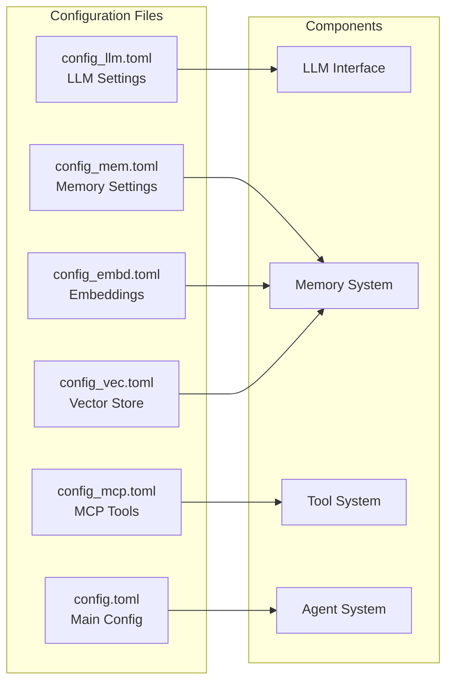

# Configuration Guide

This guide explains how to configure humanus.cpp for different use cases and environments.

## Configuration Files Overview



## Configuration Setup

### 1. Initial Setup

Copy the example configurations to the config directory:

```bash
cp -r config/example/* config/
```

### 2. LLM Configuration (`config_llm.toml`)

Configure your language model provider:

```toml
[default]
model = "gpt-4"
base_url = "https://api.openai.com/v1"
api_key = "your-openai-api-key"
timeout = 120
temperature = 0.7
max_tokens = 4096

[local]
model = "llama-2-7b-chat"
base_url = "http://localhost:8080/v1"
api_key = "not-needed"
timeout = 60
temperature = 0.7
max_tokens = 2048
```

#### LLM Provider Examples

**OpenAI**:
```toml
[openai]
model = "gpt-4"
base_url = "https://api.openai.com/v1"
api_key = "sk-..."
```

**Local llama.cpp**:
```toml
[local]
model = "model"
base_url = "http://localhost:8080/v1"
api_key = ""
```

**Anthropic Claude**:
```toml
[claude]
model = "claude-3-sonnet-20240229"
base_url = "https://api.anthropic.com/v1"
api_key = "sk-ant-..."
```

### 3. Memory Configuration (`config_mem.toml`)

Configure memory and conversation management:

```toml
[default]
max_messages = 50
enable_summarization = true
similarity_threshold = 0.7
context_window = 20

[long_term]
max_messages = 1000
enable_summarization = true
similarity_threshold = 0.6
context_window = 50
```

### 4. MCP Tool Configuration (`config_mcp.toml`)

Configure external MCP servers and tools:

```toml
[filesystem]
type = "stdio"
command = "npx"
args = [
    "-y",
    "@modelcontextprotocol/server-filesystem",
    "/Users/username/Documents",
    "/Users/username/Downloads"
]

[python_execute]
type = "stdio"
command = "python"
args = ["-m", "mcp_server", "--port", "8895"]

[browser]
type = "stdio"  
command = "npx"
args = [
    "-y",
    "@modelcontextprotocol/server-playwright"
]

[custom_tool]
type = "sse"
url = "http://localhost:9000/sse"
```

#### MCP Tool Types

**STDIO Tools** (communicate via stdin/stdout):
```toml
[tool_name]
type = "stdio"
command = "executable_name"
args = ["arg1", "arg2"]
```

**SSE Tools** (communicate via Server-Sent Events):
```toml
[tool_name]
type = "sse"
url = "http://server:port/sse"
```

### 5. Embedding Configuration (`config_embd.toml`)

Configure embedding models for memory search:

```toml
[default]
model = "text-embedding-ada-002"
base_url = "https://api.openai.com/v1"
api_key = "your-openai-api-key"
dimensions = 1536

[local]
model = "all-MiniLM-L6-v2"
base_url = "http://localhost:8081/v1"
api_key = ""
dimensions = 384
```

### 6. Vector Store Configuration (`config_vec.toml`)

Configure vector storage backend:

```toml
[default]
type = "hnswlib"
space = "cosine"
max_elements = 10000
ef_construction = 200
M = 16

[redis]
type = "redis"
host = "localhost"
port = 6379
db = 0
index_name = "humanus_vectors"
```

### 7. Main Configuration (`config.toml`)

General application settings:

```toml
[default]
log_level = "info"
log_file = "humanus.log"
max_concurrent_tasks = 4
enable_metrics = true

[agent]
max_steps = 30
duplicate_threshold = 2
default_timeout = 300

[server]
host = "localhost"
port = 8896
cors_enabled = true
```

## Environment-Specific Configurations

### Development Environment

```toml
# config_llm.toml
[default]
model = "gpt-3.5-turbo"
base_url = "https://api.openai.com/v1"
api_key = "your-dev-key"
timeout = 60

# config.toml
[default]
log_level = "debug"
log_file = "dev.log"
```

### Production Environment

```toml
# config_llm.toml
[default]
model = "gpt-4"
base_url = "https://api.openai.com/v1"
api_key = "your-prod-key"
timeout = 120

# config.toml
[default]
log_level = "warn"
log_file = "/var/log/humanus/humanus.log"
enable_metrics = true
```

### Local-Only Setup

```toml
# config_llm.toml
[default]
model = "llama-2-7b-chat"
base_url = "http://localhost:8080/v1"
api_key = ""

# config_embd.toml
[default]
model = "all-MiniLM-L6-v2"
base_url = "http://localhost:8081/v1"
api_key = ""
```

## Security Considerations

### API Key Management

1. **Environment Variables**:
   ```bash
   export OPENAI_API_KEY="your-key"
   export ANTHROPIC_API_KEY="your-key"
   ```

2. **File Permissions**:
   ```bash
   chmod 600 config/*.toml
   ```

3. **Config File Pattern**:
   ```toml
   api_key = "${OPENAI_API_KEY}"
   ```

### Network Security

1. **Local Tools Only**:
   ```toml
   [filesystem]
   args = ["/home/user/safe_directory"]  # Restrict access
   ```

2. **Firewall Rules**:
   ```bash
   # Allow only local MCP connections
   iptables -A INPUT -p tcp --dport 8895 -s 127.0.0.1 -j ACCEPT
   ```

## Troubleshooting

### Common Configuration Issues

**Issue**: "LLM configuration not found"
```bash
# Verify config file exists
ls -la config/config_llm.toml

# Check file format
toml-validator config/config_llm.toml
```

**Issue**: "MCP tool connection failed"
```bash
# Test MCP server manually
npx -y @modelcontextprotocol/server-filesystem /tmp

# Check tool configuration
cat config/config_mcp.toml
```

**Issue**: "Embedding model not accessible"
```bash
# Test embedding endpoint
curl -X POST http://localhost:8081/v1/embeddings \
  -H "Content-Type: application/json" \
  -d '{"input": "test", "model": "all-MiniLM-L6-v2"}'
```

### Validation

Create a configuration validation script:

```cpp
#include "config.h"

int main() {
    try {
        auto llm_config = Config::get_llm_config("default");
        llm_config.validate();
        
        auto memory_config = Config::get_memory_config("default");
        memory_config.validate();
        
        auto mcp_configs = Config::get_mcp_config_names();
        for (const auto& name : mcp_configs) {
            auto mcp_config = Config::get_mcp_config(name);
            mcp_config.validate();
        }
        
        std::cout << "All configurations are valid!" << std::endl;
        return 0;
    } catch (const std::exception& e) {
        std::cerr << "Configuration error: " << e.what() << std::endl;
        return 1;
    }
}
```

## Best Practices

1. **Version Control**: Keep example configs in version control, actual configs local
2. **Environment Separation**: Use different config sets for dev/staging/prod
3. **Regular Validation**: Validate configs after changes
4. **Monitoring**: Monitor API usage and costs
5. **Backup**: Backup working configurations
6. **Documentation**: Document custom tool configurations

## Configuration Schema

For detailed schema information, refer to the [API Reference](../docs/API.md#configuration).