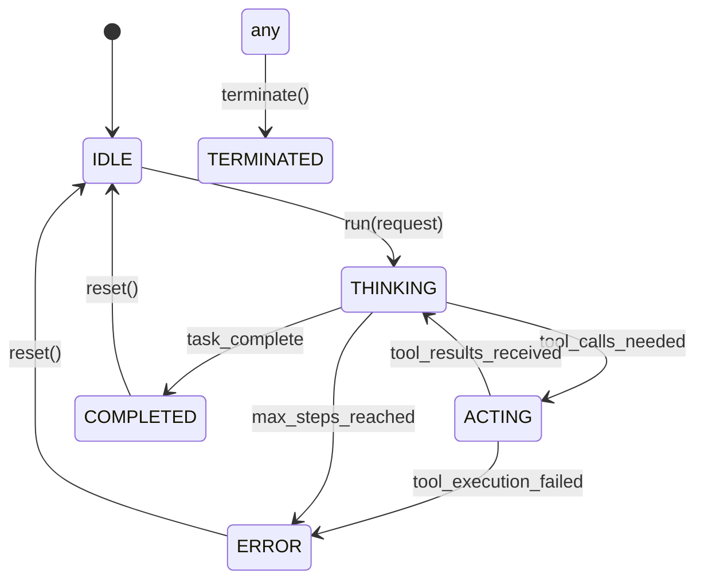

# API Reference

## Table of Contents

1. [Core Classes](#core-classes)
2. [Agent Interface](#agent-interface)
3. [Tool System](#tool-system)
4. [Memory Interface](#memory-interface)
5. [Configuration](#configuration)
6. [MCP Integration](#mcp-integration)
7. [Utilities](#utilities)

## Core Classes

### BaseAgent

Base class for all agent implementations with state management and execution control.

```cpp
class BaseAgent : public std::enable_shared_from_this<BaseAgent> {
public:
    // Constructor
    BaseAgent(
        const std::string& name,
        const std::string& description,
        const std::string& system_prompt,
        const std::string& next_step_prompt,
        const std::shared_ptr<LLM>& llm = nullptr,
        const std::shared_ptr<BaseMemory>& memory = nullptr,
        int max_steps = 10,
        int duplicate_threshold = 2
    );
    
    // Execution
    virtual std::string run(const std::string& request = "");
    virtual std::string step() = 0;
    
    // State Management
    void reset(bool clear_memory = false);
    AgentState get_state() const;
    
    // Memory Operations
    template<typename... Args>
    void update_memory(const std::string& role, const std::string& content, Args&&... args);
    
    // Properties
    std::string name;
    std::string description;
    std::string system_prompt;
    std::string next_step_prompt;
    std::shared_ptr<LLM> llm;
    std::shared_ptr<BaseMemory> memory;
    AgentState state;
    int max_steps;
    int current_step;
    int duplicate_threshold;
};
```

**Usage Example**:
```cpp
class CustomAgent : public BaseAgent {
public:
    CustomAgent() : BaseAgent(
        "custom_agent",
        "A custom agent implementation",
        "You are a helpful assistant",
        "What should I do next?"
    ) {}
    
    std::string step() override {
        // Custom implementation
        return "Task completed";
    }
};
```

### ToolCallAgent

Agent specializing in tool-based task execution.

```cpp
class ToolCallAgent : public BaseAgent {
public:
    ToolCallAgent(
        const ToolCollection& available_tools,
        const std::string& tool_choice = "auto",
        const std::vector<std::string>& special_tool_names = {},
        const std::string& name = "tool_call_agent",
        const std::string& description = "Agent that can call tools",
        const std::string& system_prompt = "",
        const std::string& next_step_prompt = "",
        const std::shared_ptr<LLM>& llm = nullptr,
        const std::shared_ptr<BaseMemory>& memory = nullptr,
        int max_steps = 10,
        int duplicate_threshold = 2
    );
    
    // Tool Operations
    ToolResult execute_tool_calls(const std::vector<ToolCall>& tool_calls);
    std::vector<ToolSchema> get_available_tools() const;
    
    std::string step() override;
    
protected:
    ToolCollection available_tools;
    std::string tool_choice;
    std::vector<std::string> special_tool_names;
};
```

**Usage Example**:
```cpp
auto tools = ToolCollection({
    std::make_shared<PythonExecute>(),
    std::make_shared<Filesystem>()
});

auto agent = std::make_shared<ToolCallAgent>(
    tools,
    "auto",
    {"terminate"},
    "my_agent"
);

std::string response = agent->run("Calculate the square root of 16");
```

### Humanus

The main general-purpose agent with comprehensive tool support.

```cpp
struct Humanus : ToolCallAgent {
    Humanus(
        const ToolCollection& available_tools = ToolCollection({
            std::make_shared<PythonExecute>(),
            std::make_shared<Filesystem>(),
            std::make_shared<Playwright>(),
            std::make_shared<ImageLoader>(),
            std::make_shared<ContentProvider>(),
            std::make_shared<Terminate>()
        }),
        const std::string& name = "humanus",
        const std::string& description = "A versatile agent that can solve various tasks using multiple tools",
        const std::string& system_prompt = prompt::humanus::SYSTEM_PROMPT,
        const std::string& next_step_prompt = prompt::humanus::NEXT_STEP_PROMPT,
        const std::shared_ptr<LLM>& llm = nullptr,
        const std::shared_ptr<BaseMemory>& memory = nullptr,
        int max_steps = 30,
        int duplicate_threshold = 2
    );
};
```

**Usage Example**:
```cpp
auto agent = std::make_shared<Humanus>();
std::string response = agent->run("Analyze data.csv and create a visualization");
```

## Agent Interface

### Agent State Management

```cpp
enum class AgentState {
    IDLE,        // Ready to receive new tasks
    THINKING,    // Processing and planning
    ACTING,      // Executing tools or actions
    WAITING,     // Waiting for external input
    COMPLETED,   // Task completed successfully
    ERROR,       // Error state requiring intervention
    TERMINATED   // Agent terminated
};
```

### Execution Flow



## Tool System

### BaseTool Interface

```cpp
class BaseTool {
public:
    virtual ~BaseTool() = default;
    
    // Tool Metadata
    virtual std::string get_name() = 0;
    virtual std::string get_description() = 0;
    virtual ToolParameters get_parameters() = 0;
    
    // Execution
    virtual ToolResult execute(const json& arguments) = 0;
    
    // Optional: Validation
    virtual bool validate_arguments(const json& arguments);
};
```

### ToolResult Structure

```cpp
struct ToolResult {
    json output;   // Primary result data
    json error;    // Error information (if any)
    json system;   // System messages, metadata
    
    ToolResult(const json& output, const json& error = {}, const json& system = {});
    
    bool empty() const;
    ToolResult operator+(const ToolResult& other) const;
    
    // Conversion
    std::string to_string() const;
    operator bool() const;  // Returns true if no error
};
```

### ToolCollection

```cpp
class ToolCollection {
public:
    // Construction
    ToolCollection(const std::vector<std::shared_ptr<BaseTool>>& tools = {});
    
    // Tool Management
    void add_tool(std::shared_ptr<BaseTool> tool);
    void remove_tool(const std::string& name);
    std::shared_ptr<BaseTool> get_tool(const std::string& name);
    
    // Execution
    ToolResult execute_tool(const std::string& name, const json& arguments);
    std::vector<ToolResult> execute_tools(const std::vector<ToolCall>& tool_calls);
    
    // Schema
    std::vector<ToolSchema> get_tool_schemas() const;
    bool has_tool(const std::string& name) const;
    std::vector<std::string> get_tool_names() const;
    
private:
    std::vector<std::shared_ptr<BaseTool>> tools;
    std::unordered_map<std::string, std::shared_ptr<BaseTool>> tool_map;
};
```

### Built-in Tools

#### PythonExecute

```cpp
class PythonExecute : public BaseTool {
public:
    std::string get_name() override { return "python_execute"; }
    std::string get_description() override { 
        return "Execute Python code and return the result"; 
    }
    
    ToolParameters get_parameters() override;
    ToolResult execute(const json& arguments) override;
};
```

**Parameters**:
- `code` (string, required): Python code to execute
- `timeout` (integer, optional): Execution timeout in seconds

**Example**:
```cpp
auto tool = std::make_shared<PythonExecute>();
json args = {
    {"code", "print(2 + 2)"}
};
auto result = tool->execute(args);
```

#### Filesystem

```cpp
class Filesystem : public BaseTool {
public:
    std::string get_name() override { return "filesystem"; }
    std::string get_description() override { 
        return "File system operations via MCP"; 
    }
    
    ToolParameters get_parameters() override;
    ToolResult execute(const json& arguments) override;
};
```

**Operations**:
- `read_file`: Read file contents
- `write_file`: Write content to file
- `list_directory`: List directory contents
- `create_directory`: Create new directory
- `delete_file`: Delete file or directory

#### Playwright

```cpp
class Playwright : public BaseTool {
public:
    std::string get_name() override { return "playwright"; }
    std::string get_description() override { 
        return "Web browser automation via MCP"; 
    }
    
    ToolParameters get_parameters() override;
    ToolResult execute(const json& arguments) override;
};
```

**Operations**:
- `navigate`: Navigate to URL
- `click`: Click element
- `type`: Type text into element
- `screenshot`: Take page screenshot
- `extract_content`: Extract page content

## Memory Interface

### BaseMemory

```cpp
class BaseMemory {
public:
    std::deque<Message> messages;
    std::string current_request;
    
    virtual ~BaseMemory() = default;
    
    // Message Management
    virtual bool add_message(const Message& message);
    virtual bool add_messages(const std::vector<Message>& messages);
    virtual std::vector<Message> get_messages(const std::string& query = "") const;
    virtual void clear();
    
    // Utilities
    size_t size() const;
    bool empty() const;
};
```

### Memory (Enhanced Memory with Vector Search)

```cpp
class Memory : public BaseMemory {
public:
    Memory(const MemoryConfig& config);
    
    // Enhanced Operations
    bool add_message(const Message& message, 
                    const std::optional<std::vector<ToolCall>>& tool_calls = std::nullopt) override;
    std::vector<Message> get_messages(const std::string& query = "") const override;
    
    // Vector Search
    std::vector<Message> search_memories(const std::string& query, int limit = 5);
    void build_index();
    
private:
    std::shared_ptr<VectorStore> vector_store;
    std::shared_ptr<EmbeddingModel> embedding_model;
    MemoryConfig config;
};
```

### Message Structure

```cpp
struct Message {
    std::string role;     // "user", "assistant", "system", "tool"
    std::string content;
    std::optional<std::vector<ToolCall>> tool_calls;
    std::optional<std::string> tool_call_id;
    std::string id;
    int64_t timestamp;
    
    // Factory Methods
    static Message user_message(const std::string& content);
    static Message assistant_message(const std::string& content, 
                                   const std::optional<std::vector<ToolCall>>& tool_calls = std::nullopt);
    static Message system_message(const std::string& content);
    static Message tool_message(const std::string& content, const std::string& tool_call_id);
    
    // Serialization
    json to_json() const;
    static Message from_json(const json& j);
};
```

## Configuration

### Config System

```cpp
class Config {
public:
    // LLM Configuration
    static LLMConfig get_llm_config(const std::string& name = "default");
    static void set_llm_config(const std::string& name, const LLMConfig& config);
    
    // Memory Configuration
    static MemoryConfig get_memory_config(const std::string& name = "default");
    static void set_memory_config(const std::string& name, const MemoryConfig& config);
    
    // MCP Configuration
    static MCPConfig get_mcp_config(const std::string& name);
    static std::vector<std::string> get_mcp_config_names();
    
    // Agent Configuration
    static AgentConfig get_agent_config(const std::string& name = "default");
    
    // Utilities
    static void load_from_file(const std::string& config_path);
    static void save_to_file(const std::string& config_path);
};
```

### Configuration Structures

```cpp
struct LLMConfig {
    std::string model;
    std::string base_url;
    std::string api_key;
    int timeout;
    double temperature;
    int max_tokens;
    std::vector<std::string> stop_sequences;
    
    // Validation
    bool is_valid() const;
    void validate() const;
};

struct MemoryConfig {
    int max_messages;
    std::string embedding_model;
    std::string vector_store_type;
    json vector_store_config;
    bool enable_summarization;
    double similarity_threshold;
    
    bool is_valid() const;
};

struct MCPConfig {
    std::string type;      // "stdio" or "sse"
    std::string command;
    std::vector<std::string> args;
    std::string url;       // For SSE type
    json extra_config;
    
    bool is_valid() const;
};
```

## MCP Integration

### MCP Client Interface

```cpp
class MCPStdioClient {
public:
    MCPStdioClient(const std::string& command, const std::vector<std::string>& args);
    ~MCPStdioClient();
    
    // Tool Operations
    mcp::CallToolResponse call_tool(const mcp::CallToolRequest& request);
    std::vector<mcp::Tool> list_tools();
    
    // Resource Operations
    mcp::ReadResourceResponse read_resource(const mcp::ReadResourceRequest& request);
    std::vector<mcp::Resource> list_resources();
    
    // Connection Management
    bool is_connected() const;
    void disconnect();
    void reconnect();
    
private:
    class Impl;
    std::unique_ptr<Impl> pimpl;
};

class MCPSSEClient {
public:
    MCPSSEClient(const std::string& url);
    ~MCPSSEClient();
    
    // Similar interface to MCPStdioClient
    mcp::CallToolResponse call_tool(const mcp::CallToolRequest& request);
    std::vector<mcp::Tool> list_tools();
    
private:
    class Impl;
    std::unique_ptr<Impl> pimpl;
};
```

### MCP Message Types

```cpp
namespace mcp {
    struct CallToolRequest {
        std::string name;
        json arguments;
    };
    
    struct CallToolResponse {
        json content;
        std::optional<json> error;
        bool is_error;
    };
    
    struct Tool {
        std::string name;
        std::string description;
        json inputSchema;
    };
    
    struct Resource {
        std::string uri;
        std::string name;
        std::optional<std::string> description;
        std::optional<std::string> mimeType;
    };
}
```

## Utilities

### Logger

```cpp
namespace humanus {
    extern std::shared_ptr<spdlog::logger> logger;
    
    void initialize_logger(const std::string& level = "info",
                          const std::string& pattern = "[%Y-%m-%d %H:%M:%S.%e] [%l] %v");
    void set_log_level(const std::string& level);
    void set_log_file(const std::string& filename);
}
```

**Usage**:
```cpp
logger->info("Agent started successfully");
logger->warn("High memory usage detected: {} MB", memory_usage);
logger->error("Failed to connect to LLM: {}", error_message);
logger->debug("Processing message: {}", message.content);
```

### Schema Utilities

```cpp
namespace schema {
    // JSON Schema validation
    bool validate_tool_parameters(const json& parameters, const json& schema);
    bool validate_message(const Message& message);
    bool validate_tool_call(const ToolCall& tool_call);
    
    // Schema generation
    json generate_tool_schema(const std::shared_ptr<BaseTool>& tool);
    json generate_message_schema();
    
    // Type conversions
    ToolCall tool_call_from_json(const json& j);
    json tool_call_to_json(const ToolCall& tool_call);
}
```

### Error Handling

```cpp
namespace humanus {
    // Exception Types
    class HumanusException : public std::runtime_error {
    public:
        HumanusException(const std::string& message);
    };
    
    class ConfigurationException : public HumanusException {
    public:
        ConfigurationException(const std::string& message);
    };
    
    class ToolExecutionException : public HumanusException {
    public:
        ToolExecutionException(const std::string& tool_name, const std::string& message);
        const std::string& get_tool_name() const;
    };
    
    class MCPException : public HumanusException {
    public:
        MCPException(const std::string& message);
    };
    
    // Error Result Types
    template<typename T>
    class Result {
    public:
        static Result<T> success(T value);
        static Result<T> error(const std::string& message);
        
        bool is_success() const;
        bool is_error() const;
        const T& value() const;
        const std::string& error_message() const;
        
    private:
        std::optional<T> value_;
        std::optional<std::string> error_;
    };
}
```

This API reference provides comprehensive documentation for all public interfaces in humanus.cpp. For implementation details and examples, refer to the source code and development guide.