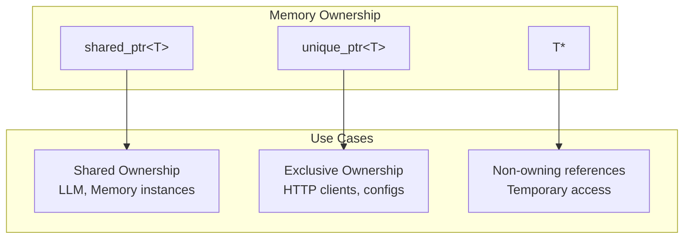

# Development Guide

## Table of Contents

1. [Getting Started](#getting-started)
2. [Architecture Deep Dive](#architecture-deep-dive)
3. [Extending humanus.cpp](#extending-humanuscpp)
4. [Testing Guidelines](#testing-guidelines)
5. [Performance Considerations](#performance-considerations)
6. [Troubleshooting](#troubleshooting)

## Getting Started

### Development Environment Setup

#### Prerequisites

- **Compiler**: GCC 7+, Clang 5+, or MSVC 2019+
- **CMake**: Version 3.10 or higher
- **OpenSSL**: Version 3.0+ for secure HTTP communications
- **Python**: 3.8+ (for Python tool integration)
- **Node.js**: 16+ (for MCP server tools)

#### IDE Configuration

**Visual Studio Code**:
```json
{
    "C_Cpp.default.configurationProvider": "ms-vscode.cmake-tools",
    "C_Cpp.default.cppStandard": "c++17",
    "cmake.debugConfig": {
        "args": ["--config", "Debug"]
    }
}
```

**CLion**: Open the project root directory and CLion will automatically detect the CMake configuration.

### Build Variants

```bash
# Debug build (development)
cmake -B build -DCMAKE_BUILD_TYPE=Debug
cmake --build build

# Release build (production)
cmake -B build -DCMAKE_BUILD_TYPE=Release
cmake --build build

# RelWithDebInfo (profiling)
cmake -B build -DCMAKE_BUILD_TYPE=RelWithDebInfo
cmake --build build
```

## Architecture Deep Dive

### Memory Management Patterns



### Thread Safety Considerations

- **LLM Interface**: Thread-safe singleton pattern with proper synchronization
- **Memory System**: Read-heavy workload with write protection
- **Tool Execution**: Isolated execution contexts per thread
- **Configuration**: Immutable after initialization

### Error Handling Strategy

```cpp
// Exception-based error handling for unrecoverable errors
class HumanusException : public std::runtime_error {
public:
    HumanusException(const std::string& message) 
        : std::runtime_error(message) {}
};

// Result-based error handling for recoverable errors
struct ToolResult {
    json output;
    json error;    // Non-empty indicates error condition
    json system;   // System messages, warnings
};
```

## Extending humanus.cpp

### Creating Custom Tools

#### 1. Basic Tool Implementation

```cpp
#include "tool/base.h"

class CustomAnalyticsTool : public BaseTool {
public:
    std::string get_name() override {
        return "analytics_tool";
    }
    
    std::string get_description() override {
        return "Performs custom analytics on data";
    }
    
    ToolParameters get_parameters() override {
        return ToolParameters{
            {"data_source", {
                {"type", "string"},
                {"description", "Path to data source"},
                {"required", true}
            }},
            {"analysis_type", {
                {"type", "string"},
                {"enum", json::array({"statistical", "predictive", "clustering"})},
                {"description", "Type of analysis to perform"}
            }}
        };
    }
    
    ToolResult execute(const json& arguments) override {
        try {
            std::string data_source = arguments["data_source"];
            std::string analysis_type = arguments.value("analysis_type", "statistical");
            
            // Tool implementation logic
            auto result = perform_analysis(data_source, analysis_type);
            
            return ToolResult(result);
        } catch (const std::exception& e) {
            return ToolResult({}, {{"error", e.what()}});
        }
    }
    
private:
    json perform_analysis(const std::string& source, const std::string& type) {
        // Implementation details
        return json{{"result", "analysis_complete"}};
    }
};
```

#### 2. MCP-Integrated Tool

```cpp
class MCPCustomTool : public BaseTool {
private:
    std::unique_ptr<MCPStdioClient> mcp_client_;
    
public:
    MCPCustomTool() {
        // Initialize MCP client connection
        auto config = Config::get_mcp_config("custom_server");
        mcp_client_ = std::make_unique<MCPStdioClient>(
            config.command, 
            config.args
        );
    }
    
    ToolResult execute(const json& arguments) override {
        auto request = mcp::CallToolRequest{
            get_name(),
            arguments
        };
        
        auto response = mcp_client_->call_tool(request);
        
        if (response.error.has_value()) {
            return ToolResult({}, response.error.value());
        }
        
        return ToolResult(response.content);
    }
};
```

### Creating Custom Agents

#### 1. Specialized Agent Types

```cpp
class DataAnalysisAgent : public ToolCallAgent {
public:
    DataAnalysisAgent() : ToolCallAgent(
        ToolCollection({
            std::make_shared<CustomAnalyticsTool>(),
            std::make_shared<PythonExecute>(),
            std::make_shared<Filesystem>()
        }),
        "auto",  // tool_choice
        {"terminate"},  // special_tool_names
        "data_analyst",
        "Specialized agent for data analysis tasks",
        get_analysis_system_prompt(),
        get_analysis_step_prompt()
    ) {}
    
private:
    std::string get_analysis_system_prompt() {
        return R"(
You are a specialized data analysis agent. Your role is to:
1. Understand data analysis requirements
2. Load and examine data sources
3. Apply appropriate analytical methods
4. Generate insights and visualizations
5. Provide clear, actionable recommendations

Always start by understanding the data structure before applying analysis techniques.
        )";
    }
    
    std::string get_analysis_step_prompt() {
        return "What is the next step in the data analysis process?";
    }
};
```

This development guide provides comprehensive information for extending and contributing to humanus.cpp. For additional questions, please refer to the main documentation or open an issue on GitHub.